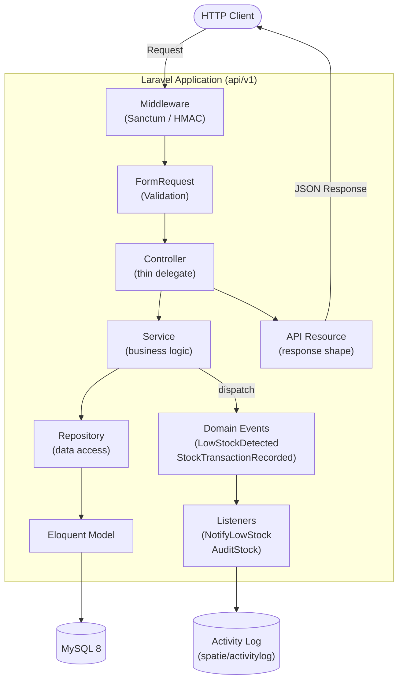

# Inventory API

A production-grade REST API for inventory and stock management built with **Laravel 13** and **PHP 8.3**.

[](https://github.com/jmpangilinan/inventory-api/actions/workflows/ci.yml)
[](https://sonarcloud.io/summary/new_code?id=jmpangilinan_inventory-api)
[](https://sonarcloud.io/summary/new_code?id=jmpangilinan_inventory-api)

---

## Features

- [x] **Authentication** — Laravel Sanctum token auth with Admin / Staff roles (Spatie Permission)
- [x] **Category management** — CRUD with soft deletes and activity logging
- [x] **Product catalogue** — CRUD with low-stock threshold detection and soft deletes
- [x] **Stock transactions** — stock-in, stock-out, adjustment with immutable audit trail
- [x] **Domain events** — `LowStockDetected`, `StockTransactionRecorded` with listeners
- [x] **Device webhook** — HMAC-SHA256 signed endpoint for barcode scanners and weighing scales
- [x] **Audit logs** — Admin-only read endpoint over Spatie Activitylog
- [x] **Swagger UI** — auto-generated OpenAPI 3.0 docs via PHP 8 Attributes
- [x] **GitHub Actions CI** — Pint, Larastan, PHPUnit + coverage, SonarCloud quality gate
- [x] **Docker** — single-command local setup

---

## Architecture



### Layer responsibilities

| Layer | Location | Rule |
|---|---|---|
| FormRequest | `app/Http/Requests/` | Validation + authorization only |
| Controller | `app/Http/Controllers/Api/` | Thin — validate → delegate → return resource |
| Service | `app/Services/` | All business logic; throws domain exceptions |
| Repository | `app/Repositories/` | Data access only; no business logic |
| Model | `app/Models/` | Relationships, casts, scopes only |
| API Resource | `app/Http/Resources/` | Response shaping only |

---

## Quick start

```bash
# 1. Clone and copy env
git clone https://github.com/jmpangilinan/inventory-api.git
cd inventory-api
cp .env.example .env

# 2. Start containers (PHP 8.3-fpm, nginx, MySQL 8)
docker compose up -d

# 3. Install dependencies
docker compose exec app composer install

# 4. Generate app key and run migrations
docker compose exec app php artisan key:generate
docker compose exec app php artisan migrate --seed

# 5. Open Swagger UI
open http://localhost:8000/api/documentation
```

---

## Environment variables

| Variable | Default | Description |
|---|---|---|
| `APP_KEY` | — | Laravel app key — run `php artisan key:generate` |
| `DB_HOST` | `mysql` | MySQL container hostname |
| `DB_DATABASE` | `inventory_api` | Database name |
| `DB_USERNAME` | `sail` | Database user |
| `DB_PASSWORD` | `password` | Database password |
| `DEVICE_WEBHOOK_SECRET` | — | Shared secret for HMAC-SHA256 device signatures |
| `L5_SWAGGER_GENERATE_ALWAYS` | `true` | Auto-regenerate OpenAPI spec on each request |
| `L5_SWAGGER_CONST_HOST` | `http://localhost:8000/api/v1` | Swagger UI server base URL |

---

## API endpoints

All endpoints are prefixed `/api/v1`. Protected routes require `Authorization: Bearer <token>`.

### Auth
| Method | Path | Description |
|---|---|---|
| `POST` | `/auth/register` | Register and receive token |
| `POST` | `/auth/login` | Login and receive token |
| `POST` | `/auth/logout` | Revoke current token |
| `GET` | `/auth/me` | Authenticated user |

### Categories
| Method | Path | Description |
|---|---|---|
| `GET` | `/categories` | List all |
| `POST` | `/categories` | Create |
| `GET` | `/categories/{id}` | Show |
| `PUT` | `/categories/{id}` | Update |
| `DELETE` | `/categories/{id}` | Soft delete |

### Products
| Method | Path | Description |
|---|---|---|
| `GET` | `/products` | List all (paginated) |
| `POST` | `/products` | Create |
| `GET` | `/products/{id}` | Show |
| `PUT` | `/products/{id}` | Update |
| `DELETE` | `/products/{id}` | Soft delete |
| `GET` | `/products/low-stock` | Products at or below threshold |

### Stock transactions
| Method | Path | Description |
|---|---|---|
| `GET` | `/products/{id}/transactions` | Transaction history for a product |
| `POST` | `/stock-transactions` | Record stock-in / out / adjustment |

### Device webhook
| Method | Path | Description |
|---|---|---|
| `POST` | `/device/webhook` | HMAC-signed payload from hardware device |

### Audit logs
| Method | Path | Description |
|---|---|---|
| `GET` | `/audit-logs` | Activity log — Admin only |

---

## Swagger UI

Visit `http://localhost:8000/api/documentation` after starting Docker.

The spec is auto-generated from PHP 8 Attributes on the controllers using `darkaonline/l5-swagger` and `zircote/swagger-php v6`.

---

## Development commands

```bash
# Code style (Laravel Pint — PSR-12)
docker compose exec app ./vendor/bin/pint

# Static analysis (Larastan level 6)
docker compose exec app ./vendor/bin/phpstan analyse --memory-limit=512M

# Tests with coverage (80% minimum)
docker compose exec app php artisan test --coverage --min=80

# Local SonarCloud scan
SONAR_TOKEN=your_token make sonar

# Interactive shell
docker compose exec app bash
```

---

## CI / CD

GitHub Actions runs on every push and pull request to `develop` and `main`:

| Job | Tool | Gate |
|---|---|---|
| Code Style | Laravel Pint | PSR-12 — zero violations |
| Static Analysis | Larastan | Level 6 — zero errors |
| Tests | PHPUnit + Xdebug | All pass, ≥80% coverage |
| Quality Gate | SonarCloud | ≥80% coverage on new code, no new bugs |

Branch protection:
- `main` — requires 1 approval + all CI checks
- `develop` — requires CI checks only

---

## Architecture Decision Records

| ADR | Title | Status |
|---|---|---|
| [ADR-001](docs/adr/001-repository-pattern.md) | Repository Pattern for Data Access | Accepted |
| [ADR-002](docs/adr/002-sanctum-over-passport.md) | Sanctum over Passport for API Token Auth | Accepted |
| [ADR-003](docs/adr/003-activity-log-strategy.md) | Spatie Activitylog over Custom Audit Table | Accepted |
| [ADR-004](docs/adr/004-device-webhook-security.md) | HMAC-SHA256 Signature Verification for Device Webhooks | Accepted |

---

## Tech stack

| Concern | Technology |
|---|---|
| Framework | Laravel 13 / PHP 8.3 |
| Authentication | Laravel Sanctum |
| Roles | Spatie Laravel Permission |
| Audit trail | Spatie Laravel Activitylog |
| API docs | L5-Swagger + swagger-php v6 (PHP Attributes) |
| Static analysis | Larastan (PHPStan) level 6 |
| Code style | Laravel Pint (PSR-12) |
| Testing | PHPUnit + Xdebug coverage |
| Quality gate | SonarCloud |
| Containers | Docker + Docker Compose (PHP-fpm, nginx, MySQL 8) |
| CI/CD | GitHub Actions |
